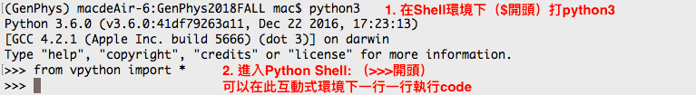
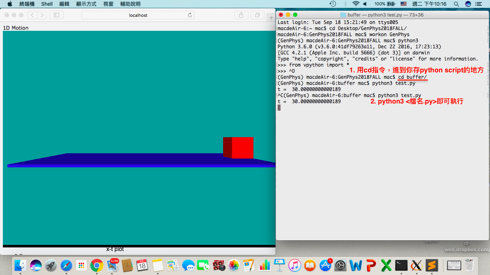

# VP1: Simple Start for Vpython, Projectile \[the basic of Python, while\]  

## [影片以及作業說明](http://tcjd71.wixsite.com/vpython/copy-of-5)  
+ [影片](https://www.youtube.com/playlist?list=PLxowpOHFnGyPYeJTm6QGmZUEbnZAsyJA_)  
+ [作業說明pdf](https://drive.google.com/file/d/1IyYWUNxHgl9QLs6jyvTx4GvkDxYl-cfW/view)  

## Contents
+ [python3 x vpython7 Installation](https://github.com/janice-cat/GenPhys2019FALL/tree/master/hw1#python3-x-vpython7-installation)  
+ [Free Fall](https://github.com/janice-cat/GenPhys2019FALL/tree/master/hw1#free-fall)  
+ [Arrow](https://github.com/janice-cat/GenPhys2019FALL/tree/master/hw1#arrow)    
+ [Homework](https://github.com/janice-cat/GenPhys2019FALL/tree/master/hw1#homework)  

## python3 x vpython7 Installation  
Follow the steps in “安裝” at http://tcjd71.wixsite.com/vpython/install to install:  
1. For Windows: http://tcjd71.wixsite.com/vpython/copy-of-python-3-vpython-7-1  
2. For Mac: http://tcjd71.wixsite.com/vpython/copy-of-python-3-vpython-7-pc  
  

## Free Fall  
Type (type instead of “cut-and-paste” can help you learn coding) and then run the codes. *** Hold the right mouse button and move mouse to change view angle. Hold both buttons and move the mouse to zoom in or out.  

```python
from vpython import *
g=9.8           # g = 9.8 m/s^2
size = 0.25     # ball radius = 0.25 m
height = 15.0   # ball center initial height = 15 m

scene = canvas(width=800, height=800, center =vec(0,height/2,0), background=vec(0.5,0.5,0))   # open a window
floor = box(length=30, height=0.01, width=10, color=color.blue)                               # the floor
ball = sphere(radius = size, color=color.red, make_trail = True, trail_radius = 0.05)         # the ball
msg =text(text = 'Free Fall', pos = vec(-10, 10, 0))

ball.pos = vec( 0, height, 0)         # ball center initial position
ball.v = vec(0, 0 , 0)                # ball initial velocity

dt = 0.001                            # time step
while ball.pos.y >= size:             # until the ball hit the ground
    rate(1000)                        # run 1000 times per real second
    
    ball.pos = ball.pos + ball.v*dt 
    ball.v.y = ball.v.y - g*dt
 

msg.visible = False
msg =text(text = str(ball.v.y), pos = vec(-10, 10, 0)) 
print(ball.v.y)
```

### Code explanation:
1. *** Declaring using VPython module. All our simulation programs will have this first line  
    ```python
    from vpython import *
    ```
2. Setting constants. For convenience, all physical quantities in the simulation world are always with SI units.  
    *** Texts after `#` are not parts of the program, they are remarks.  
    ```python
    g=9.8           # g = 9.8 m/s^2
    size = 0.25     # ball radius = 0.25 m
    height = 15.0   # ball center initial height = 15 m
    ```
3. Opening a window.  
    ```python
    scene = canvas(width=800, height=800, center =vec(0,height/2,0), background=vec(0.5,0.5,0))
    ```
    *** Open a window named `scene` with 800 horizontal pixels and 800 vertical pixels. In the simulation world, before changing the view angle, +x axis points to the right is, +y to the top, +z pointing out the screen. `center` is the position vector of the center of the simulation world. vec(x, y, z) means a 3D vector.  
    *** `background` sets the background color to vec(red, green, blue), which indicates the strength for red, green, and blue, respectively, scaled from 0.0 to 1.0,. **_Always set this attribute to some background color, otherwise the background defaults to black, making results difficult to see, especially with a projector._**  
4. Objects in simulation world.  
    ```python
    floor = box(length=30, height=0.01, width=10, color=color.blue)                               # the floor
    ```
    This draws a box of length = 30 (in x), height = 0.01(in y), and width = 10 (in z) called `floor`. You may use `floor.pos` to assign its center, e.g. `floor.pos = vec(1,0,0)`. Without this, the center defaults at vec(0,0,0).  
    *** In Python, A.B means the “attribute B of A”. The color of the floor is blue.  
      
    *** `vector() or vec()` is used to present a vector, such as a=vector(1, 2, 3), in which all three components are float (i.e here 1 is 1.0,...). More, a.x means the x component of a. We can use `print(a.x)` to show the x component of vector a or `a.x = 5` to set the x component of a to 5. floor.pos is also a vector, therefore `floor.pos.x` is the x component of `floor.pos`. Similarly, for y and z.  
      
    ```python
    ball = sphere(radius = size, color=color.red, make_trail = True, trail_radius = 0.05)
    ```
    This draws a sphere called ball, with `radius = size` and `color=color.red`. Later, we may assign the center position of the ball, such as `ball.pos = vector(1, 0, 0)`, and we can also attach more attributes to `ball`, such as `ball.v = vector(2, 0, 0)`. Attribute `make_trail = True` makes a trail of the object. The thickness of the trail is set by trail_radius.  
      
    ```python
    msg =text(text = 'Free Fall', pos = vec(-10, 10, 0))
    ```
    This code shows a message with a text content ‘Free Fall’ at `pos = vec(-10, 10, 0)`.  
5. Start the simulation  
    ```python
    ball.pos = vec( 0, height, 0)         # ball center initial position
    ball.v = vec(0, 0 , 0)                # ball initial velocity
    ```
    These two set the initial conditions.  
      
    ```python
    dt = 0.001
    ```
    dt sets how much real time elapses in one step in the following `while` loop. The size of dt depends on the time scale of the simulation events. Too small, the simulation takes too long. Too large, the simulation will be too rough and cause incorrect results. For free fall, an event of several seconds, dt = 0.001 is just fine. For atom collision events in  seconds, dt should be  . For Earth to circle around the sun it takes about  seconds,then dt= is fine.  
      
    ```python
    while ball.pos.y >= size:
    ```
    *** We use the “while loop” command all the time. The condition between `while` and colon( : ) is tested. If it is satisfied, all **the indented codes (associated codes)** below colon are executed once. Then the condition will be retested again and the process will repeat until the condition is no longer satisfied (here, it means that the y component of the ball’s center position is no longer larger than the ball radius, meaning the ball touches the floor). At this moment, Vpython stops executing the `while` loop and its associated codes, but then to continue to the next section of the codes (here, it is `msg.visible = False`)  
    *** In Python, **indentation of a section of codes** (you can do this by press tab key) means this section of codes is associated with the previous line of code with colon ( : ).  
       
    ```python
    rate(1000)
    ```
    *** This sets the while loop to run 1000 times per real-world second. With dt=0.001, this simulation runs at a speed of 1000\*0.001 = 1 of real-world time, meaning the result is presented as in real-world time. If rate(500), 500\*0.001 = 0.5, then the result is presented at a slow motion of 0.5 real-world time.  
       
    ```python
    ball.pos = ball.pos + ball.v*dt         Let ball.pos to increase ball.v*dt in one dt
    ball.v.y = ball.v.y - g*dt              Let ball.v.y to increase -g*dt in one dt.
                                            These two lines are the most basic to describe kinetics of moving bodies
    ```
      
      
    ```python
    msg.visible = False
    msg =text(text = str(ball.v.y), pos = vec(-10, 10, 0))
    ```
    After the while loop stop running due to the unsatisfactory condition, the next two lines of code make the previous message text “Free Fall” invisible and then show at the same position the y component of the ball’s velocity. Here, str() transforms a number to a string text. For example, `str(5.5)` gives you a text string =’5.5’ You can also print this value on the shell screen by  
    ```python
    print(ball.v.y)
    ```

## Arrow  
```python
from vpython import *
scene = canvas(width=800, height=800, background=vec(0.5,0.5,0))            # open a window
a1 = arrow(color = color.green, shaftwidth = 0.05)
b1 = arrow(color = color.blue, shaftwidth = 0.05)

a1.pos = vec(1, 1, 0) 
a1.axis = vec(1, -1, 0) 
b1.pos = a1.pos + a1.axis 
b1.axis = vec(2, 1, 0)

c1 = arrow(color = color.yellow, shaftwidth=0.05) 
c1.pos = a1.pos
c1.axis = a1.axis + b1.axis
```
In this program, it draws two arrows, a1 and b1, with color being `green` and `blue`, respectively and with `shaftwidth = 0.05`. `arrow` has attributes like `pos`, `axis`, and `color`. E.g. `a1.pos = vector(1, 1, 0)` makes the starting point of a1 at (1, 1, 0), `a1.axis = vec(1, -1, 0)` draws a1 as a vector of (1, -1, 0). Similarly, b1 starts at a1’s arrow tip and has an axis of vector `vec(2, 1, 0)`. If you follow the codes for arrow c1, you can find that this is actually a representation of a vector addition, vector a1 + vector b1 = vector c1.  

## Homework  
You need to hand in your homework with a filename extension ‘.py’. If you are writing your homework in Jupyter, you need to extract the complete runnable codes and save them in just one ‘.py’ file.  
> **[Note]** You should specify the units in your answers.  
  
### MUST (5%)  
Modify the Free Fall program. Let the ball’s initial position = vec(-15, 5, 0) and with initial velocity = vec (6, 8, 0). Add at the center of the ball an arrow, which moves along with the ball and whose length is proportional (proportional constant by your choice) to and parallel to the velocity vector of the ball. In the end, show the displacement of the ball for the entire flight.  

### BONUS (1%)  
Add some codes to find the following values and show the values in the end.  
1. The flying time in the air.  
2. The length of the entire path. (Note: in python, `x**p` means x to power p, )  

### Deadline  
`9/29 SUN 22:00`  

### Grading Criteria  
1. Must  
    0: No Submission.  
    1: The program is totally not runnable.  
    2: There are some subtle bugs in the projectile animation so that it behaves abnormally.  
    3: The physics of the projectile animation is correct, but you miss other elements. (e.g. Not drawing the velocity arrow, not showing the displacement...)  
    4: The projectile animation is correct, but the displacement value is wrong.  
    5: The projectile animation is correct, and so for the displacement value.  
2. Bonus    
    If you have 1 question correct (either one), you get this 1 point credit.  

### Q&A  
1. **\[重要\]** 請大家千萬不要直接帶公式去算作業要求的物理量!!!程式作業是希望同學去學習如何"模擬"，因此這些物理量也請大家用模擬得到喔。  
    + 例如：求拋體運動，球的終點？  
    請不要用帶拋體運動公式算。我要的答案是跑過while迴圈，模擬告訴你終點值。
    + 模擬做出來的與理論值總是會有精度差異。所以如果你的答案"太精準"，助教就會去關心你的code喔～  
    + 但是非常鼓勵同學先用手算，再與模擬得出的量值做比較。  
<!-- 2. **\[重要\]** 請大家注意print出的物理量 **要寫單位** !!! 但因為助教這次沒有在開始時就宣佈，所以不會扣分。但請看到的同學，就順手把單位print出來吧，謝謝～  
3. 程式執行到最後要show數值到畫面上時（使用`text`物件）會出現延遲的現象。  
    A: 這是正常狀況。如果使用`label`物件就不會有這樣的問題發生。這延遲的狀況不影響作業計分，但有興趣的同學，可以自己先研究`label`物件的使用方法（請大家善用[vpython documentation](http://www.glowscript.org/docs/VPythonDocs/index.html)，你們一個學年將和他度過）。不過label的用法我會在作業一結束之後一起說明。  
4. 想要用一個`text`物件或`label`物件顯示完2 (or 3)行。  
    A: 可以用換行符`\n`做到。  
    作業一結束之後，會教大家一些實用的字串小技巧。  
5. `vector`物件的實用成員方法(method)或是函式(function)，例如你想要算向量的長度...:  
[vector object documentation](http://www.glowscript.org/docs/VPythonDocs/vector.html)一樣在VPython7的Documentaion有提到喔！魔鬼都藏在這裡面了(?)  
6. `rate(frequency)`和`dt`該怎麼設？  
    A: rate(frequency)函式控制一秒鐘跑幾個while loop iteration，因此你可以藉由 frequency x dt 推算現實一秒鐘代表程式幾秒鐘。  
    ex)
    ```python
    dt = 0.01  
    while(1):
        rate(1000) # means that 1 sec in real life = 10 sec in this program
    ```
    Ref: VPython6's documentation （有rate函式的一些有用解釋，也有提到動畫畫面更新的頻率）  
    http://vpython.org/contents/docs/index.html  
7. **\[Mac用戶\]** 如何在終端機上使用python?  
    開啟終端機  
    + Interactive Shell:  
        + 進入python shell:  
             
        + 退出方式：ctrl-d退出  
    + Run with script:  
        ```bash
        cd <path_to_the_directory_of_xxx.py>
        python3 xxx.py
        ```
        
        + 中斷方式：直接將瀏覽器分頁關掉，或是按ctrl-c退出。  
        + 我要在哪裡寫script？  
          一般文字編輯器即可，如果你沒有，可以安裝[Sublime Text3](https://www.sublimetext.com/3)  
 -->
2. 解釋：  
    + the displacement: 位移量。  
    + the length of the entire path: 路徑長。  
3. 請將作業上傳至ceiba作業區：  
    + 點入“程式作業hw1”條目就可以看到繳交欄位了，直接把檔案附加上去，就ok了。記得要先"用學號登入"，否則你看不到繳交欄位。  
<!--     + 如果仍有繳交問題，請儘快寄信告知。無法解決的話，會開放同學用email繳交。   -->