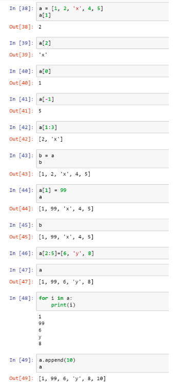

# VP3: SHM \[tuple, list, for\]  

## [Video and HW PDF](http://tcjd71.wixsite.com/vpython/copy-of-5)  
+ [Video](https://www.youtube.com/playlist?list=PLxowpOHFnGyMWhKMOp_hcQ8SVXdA7BWvd)  
+ [HW pdf](https://drive.google.com/file/d/1WZ-1m4uq20RBZJn1KmEiFPf8rDGlmYLp/view)  

## Contents
+ [List](https://github.com/janice-cat/GenPhys2019FALL/tree/master/hw3#i-list)  
+ [Simple Harmonic Motion](https://github.com/janice-cat/GenPhys2019FALL/tree/master/hw3#ii-simple-harmonic-motion)  
+ [Multiballs](https://github.com/janice-cat/GenPhys2019FALL/tree/master/hw3#iii-multiballs)  
+ [Homework](https://github.com/janice-cat/GenPhys2019FALL/tree/master/hw3#iv-homework)  

## I. List
Variable `a` is assigned to a ‘list’, which is an ‘ordered collection of objects’. The objects can be integers, floats, strings, lists, or any other objects. In the example here, the 0th element of `a` is integer 1, the 1st is integer 2, the 2nd is ‘x’, and so forth. (Notice that in python, the order starts at 0.) More importantly, the elements of list can be mixed of any different types.  

1. `a[0]` means the 0-th element of list `a`.  
2. `a[-1]` means the last element of list `a`.  
3. `a[1:3]` is the list content of the 1st and 2nd elements (the one before 3) of list a.  
4. `b = a` makes variable `b` point to the same list as variable `a`. (See the
following Note)  
5. If we assign 99 to the 1st element of the list `a`, then the list becomes
`[1, 99, ‘x’, 4, 5]`. Since `b` points to the same list as `a`, if we show list `b`, we will see the same contents.  
6. We can assign multiple consecutive elements at once, such as
`a[2:5]=[6, ‘y’, 8]`. Then, the list becomes `[1, 99, 6, ‘y’, 8]`  
7. 
    ```python
    for i in a:
        associated codes.....
    ```
    The code lets `i` be each element in list `a` (in order) and then execute the associated codes until it runs out all the elements.  
8. One can use `a.append(10)` to append a new element `10` at the end
of list `a`.  

**Note:**  
There are two storing spaces in python to store the variables,
Namespace and Valuespace. Namespace stores the variable names, such as `x`, `ball`, `ball.v`, and etc. and Valuespace stores the values, such as `3, 5.0`, and `vec(5, 0, 3)`. When we write `x = 1`, in python, it does the following. First it creates a space in Valuespace and store the value 1 there. Then it creates a variable name ‘x’ in Namespace. Finally, it let ‘x’ be pointed to 1.
When we write `y = x + 2`, it takes out explicitly the value the variable name ‘x’ points to, which is 1, adds it by 2 and gets 3, creates a new space in Valuespace and stores 3 there. Finally, it creates variable ‘y’ and points ‘y’ to this space containing 3. If we write `x = x + 2` the procedure is similar but only that ‘y’ is not created but instead ‘x’ is reused and pointed to value 3. What is the difference between this and `x += 2`? In this, it goes to the space in Valuespace where ‘x’ points to, and add 2 directly ***on-site***. With this, you can understand, why `b = a` causes `b` to points to the same list as `a` and this causes the effects shown in point 5 above.  

## II. Simple Harmonic Motion  
```python
from vpython import *

g = 9.8
size, m = 0.05, 0.2
L, k = 0.5, 15
scene = canvas(width=500, height=500, center=vec(0, -0.2, 0), background=vec(0.5,0.5,0))
ceiling = box(length=0.8, height=0.005, width=0.8, color=color.blue)
ball = sphere(radius = size, color=color.red)
spring = helix(radius=0.02, thickness =0.01) # default pos = vec(0, 0, 0)
ball.v = vec(0, 0, 0)
ball.pos = vec(0, -L, 0)
  
dt = 0.001 
while True:
    rate(1000)
    spring.axis = ball.pos - spring.pos                                 # new: extended from spring endpoint to ball
    
    spring_force = - k * (mag(spring.axis) - L) * spring.axis.norm()    # to get spring force vector
    ball.a = vector(0, - g, 0) + spring_force / m                       # ball acceleration = - g in y + spring force /m
    
    ball.v += ball.a*dt
    ball.pos += ball.v*dt
```
1. Tuple assignment  
`size, m = 0.05, 0.2` or `(size, m) = (0.05, 0.2)`  
*** `(0.05, 0.2)` is a tuple data type. When two tuples are on either sides of a ‘=’, the values are assigned term by term. This can be done for as many terms as long as both sides have the same number of variables and values.  
    
2. Draw a spring, by `spring = helix(radius=0.02, thickness =0.01)`, as a helix object with radius = 0.02 and thickness = 0.01. Its endpoint defaults to position vector(0, 0, 0). The parameters can be set by `spring = helix(pos = vector(0,0,0), radius=0.02, thickness =0.01)` when it is constructed, or they can be changed later by assignment, such as `spring.pos = vector(0,0,0)`. The `axis` attribute, such as used in `spring.axis = ball.pos - spring.pos`, draws the spring from `spring.pos` to `ball.pos`  

3. Force vector by the spring,  
    ```python
    spring_force = - k * (mag(spring.axis) - r) * spring.axis.norm()
    ```  
    mag(a vector) is a function that yields the magnitude of the vector. The norm() ‘method’ will give the unit direction vector of the vector attached, e.g. `spring.axis.norm()` gives the unit direction vector for spring.axis. Can you figure out why this line of code yields the force generated by the spring on the ball?  

4. Find the acceleration  
    ```python
    ball.a = vector(0, - g, 0) + spring_force / m
    ```
## III. Multiballs  
```python
from vpython import *

g = 9.8
size, m = 0.05, 0.2
L, k = 0.5, [15, 12, 17]
v = [1, 2, 2.2]
d = [-0.06, 0, -0.1]

scene = canvas(width=400, height=400, center =vec(0.4, 0.2, 0), align = 'left', background=vec(0.5,0.5,0))
floor = box(pos = vec(0.4, 0, 0), length=0.8, height=0.005, width=0.8, color=color.blue)
wall = box(pos= vec(0, 0.05, 0), length = 0.01, height = 0.1, width =0.8)

balls = []
for i in range(3):
    ball = sphere(pos = vec(L+d[i], size, (i-1)*3*size), radius = size, color=color.red) 
    ball.v = vec(v[i], 0, 0)
    balls.append(ball)
    
springs =[]
for i in range(3):
    spring = helix(pos = vec(0, size, (i-1)*3*size), radius=0.02, thickness =0.01) 
    spring.axis = balls[i].pos-spring.pos
    spring.k = k[i]
    springs.append(spring)
```
This code generates a list of 3 ball objects on the floor, a list of 3 springs connecting the 3 balls, respectively, to the wall. Have a look how `for` is used in this program.  
The only thing new to you is  
```python
for i in range(3): 
    code....
```
for which `i` is assigned sequentially to 0, 1, and 2 and the associated code are executed. If we want to execute from 1 to 2, we can use  
```python
for i in range(1,3):
    code....
```

## IV. Homework

### MUST (5%)  
Combine the above program and write a simulation program that has three horizontal SHMs (of different spring constants, of different starting positions, of different starting velocities).  
(1) Plot versus time the total of the instant kinetic energies of the three balls, and the total of the instant spring potential energy of the three balls in the same graph.  
(2) Plot versus time the averaged total kinetic energy over the time period (from the beginning of the simulation till the time of the current plot point) and the averaged total spring potential energy. What interesting results do you find?  

### BONUS (1%)  
First generating two lists,  
```python
sizes = [0.06, 0.04]     # for balls’ sizes 
ms = [0.2, 0.12]         # for balls’ mass
```
Instead of hanging one ball on the spring to the ceiling, let the two balls connect together horizontally by the spring. Ignore the gravity and simulate the oscillation of the two-ball system in x axis. The spring length `L` and constant `k` are 0.5 and 15, respectively. Both balls are initially at rest with their positions separated by `1.1*L`. Print the period of the oscillation. (not by formula)  

### HW submission (PLZ be particularly aware!!)

+ Please upload a `zip` file (a compressed file) to CEIBA. Note that the filename extension should be `.zip`, and other format (e.g. `.rar` , `.tar` ...) is not allowed!!  
+ In the zip file, there will be **a directory whose name is your student ID.** The directory should contain 1 or 2 python scripts. Please name the script of must part: `must.py`, and bonus part: `optional.py`.  
+ Please also upload the `zip` file, even if you only plan to submit `must.py`. (This would help ease the burden for me to grade the hw. Thanks for the cooperation \~\~ :grin:)  

Example of submitted format: 
```
homework.zip
└── r07222016
    ├── must.py
    └── optional.py
```

### Deadline  
`10/20 SUN 22:00`  

### Grading Criteria (For Reference)    
Must  
    0: No Submission.  
    1: The program is totally not runnable.  
    2: There are some subtle bugs in the animation so that it behaves abnormally.  
    3: The physics of the animation is correct, but you miss other elements, (e.g. Not drawing one of the graphs) or they do not make sense at all.  
    4: The physics of the animation is correct, but you get slightly wrong with the graph(s).  
    5: You complete all the requirements, and they are all correct.  
