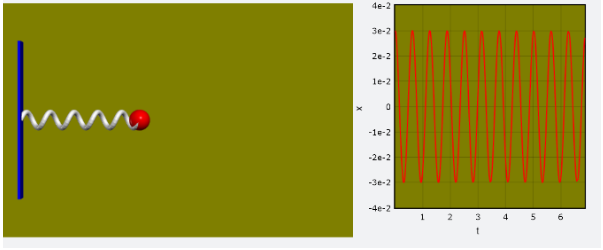
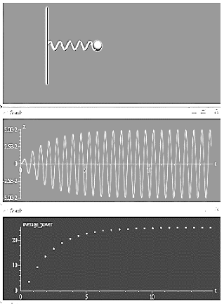
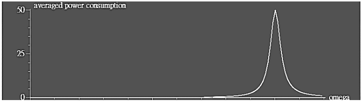
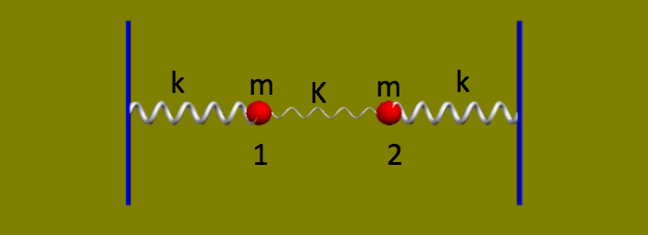

# VP6: Damped Oscillator and Coupled Oscillator [empty class, list representation]

## Video and HW pdf

+ [Video](https://goo.gl/xcZafB)  
+ [HW pdf](https://drive.google.com/file/d/1rs3c4JJj67Gp_8b8WvgV5NyHXnOVPxw7/view)  

## Contents

+ [List Representation](#i-list-representation)  
+ [Practice](#ii-practice)  
+ [Homework](#iii-homework)  

## I. List Representation

1. range(). Notice the number in range should be integer (int)

   ```python
   L = range(5)        # list(L) = [0, 1, 2, 3, 4]
   L = range(4, 9)     # list(L) = [4, 5, 6, 7, 8]
   L = range(1, 6, 2)  # list(L) = [1, 3, 5] 1 to 6 every other 2 numbers
   ```

2. list representation. Sometimes we want to generate a list with some conditions, e.g.

   ```python
   L = [i**2 for i in range(5)]            # = [0, 1, 4, 9, 16]
   L = [0.1*i*pi for i in range(-3, 3)]    # = [-0.3*pi, -0.2*pi, -0.1*pi, 0, 0.1*pi, 0.2*pi]
   L = [i**2 for i in range (5) if i != 3] # = [0, 1, 4, 16]
   ```

3. List representation can be used in a nested structure, or for dictionary or tuple. e.g.
   ```python
   L = [i*10 + j for i in range(3) for j in range(5) ] # = [0, 1, 2, 3, 4, 10, 11, 12, 13, 14, 20, 21, 22, 23, 24]
   D = {i:i**2 for i in [0, 1, 2]}                     # = {0:0, 1:1, 2:4}
   ```

## II. Practice

```python
from vpython import *
size, m = 0.02, 0.2  # ball size = 0.02 m, ball mass = 0.2kg
L, k = 0.2, 20       # spring original length = 0.2m, force constant = 20 N/m
amplitude = 0.03
b = 0.05 * m * sqrt(k/m)

# =========== delete below in practice 3 ===========
scene = canvas(width=600, height=400, fov=0.03, align='left', center=vec(0.3, 0, 0), background=vec(0.5, 0.5, 0))
wall_left = box(length=0.005, height=0.3, width=0.3, color=color.blue) # left wall
ball = sphere(radius=size, color=color.red)                            # ball
spring = helix(radius=0.015, thickness=0.01)
oscillation = graph(width=400, align='left', xtitle='t', ytitle='x', background=vec(0.5, 0.5, 0))
x = gcurve(color=color.red, graph=oscillation)
# =========== delete above in practice 3 ===========

ball.pos = vector(L+amplitude, 0 , 0)  # ball initial position
ball.v = vector(0, 0, 0)               # ball initial velocity
ball.m = m
spring.pos = vector(0, 0, 0)
t, dt = 0, 0.001

while True:
    # =========== delete below in practice 3 ===========
    rate(1000)
    # =========== delete above in practice 3 ===========
    
    spring.axis = ball.pos - spring.pos # spring extended from spring endpoint A to ball
    spring_force = -k * (mag(spring.axis) - L) * norm(spring.axis) # spring force vector
    ball.a = spring_force / ball.m     # ball acceleration = spring force /m - damping
    ball.v += ball.a*dt
    ball.pos += ball.v*dt
    t += dt
    
    # =========== delete below in practice 3 ===========
    x.plot(pos=(t, ball.pos.x - L))
    # =========== delete above in practice 3 ===========
```

Modified from hw3, the above code simulates the horizontal oscillation of a given **amplitude**.  
 

1. Now, in addition to the restoring force from the spring, add the air resistance force  to the ball with **damping factor** .  

2. Follow Practice 1, but instead of letting the ball to oscillate from the initial **amplitude**, i.e. `ball.pos = vector(L+amplitude, 0, 0)`, now let the ball to be initially at rest at  , i.e. `ball.pos = vector(L, 0, 0)`, and allow a sinusoidal force  (  is the unit vector in x-axis) applied on the ball, with  and . We know when a force  exerts on an object of velocity , the power on the object by the force is  . 
   
   Find by your simulation , the power averaged over a period  at the end of each period. In additional to the curve graph for ball’s position versus time, plot a dot graph for  versus time. Observe the results with different settings, such as  and/or with different `b` values. Think about the results. Before proceeding to Practice 3, change  and `b` back to the original values.  

   

3. Often, we do not want an animated simulation, which is slow due to the animation, but only the calculation results. We can modify the above computer codes easily for such purpose. We can just delete the code that creates the canvas, the plot, and the graphs (marked in the codes), delete `rate(1000)`, and replace codes that generate visual objects by the following codes that generate objects from an empty class.   

   ```python
   class obj:
       pass
       
   wall_left, ball, spring = obj(), obj(), obj()
   ```

   With these, we still do the same simulation but do not animate them. This will speed up the simulation. Instead of plotting  , now only print  every period. You can see after certain number of periods, the system reaches a **steady state** and the  is almost a constant. Also notice that how much faster the simulation can run without the animation. (NOTICE: for this technique to work, you need to have all the proper parameters set for every object after they have been created by the empty class `obj`.)  

## III. Homework

### MUST (5%)

Let `omega = [0.1*i + 0.7*sqrt(k/m) for i in range(1, int(0.5*sqrt(k/m)/0.1))]` and by using `for omega_d in omega:`, perform the calculation for steady-state  like practice 3 for different  . Do not print the result. Instead, for each  , when the system reaches steady state, add the latest result of the steady-state  to the plot of the “steady-state  versus `omega_d`” and then calculate the steady-state  for the next  . You will get something similar to the figure shown here, which shows clearly the system’s response to different driving frequency  . In additional to plotting steady-state  versus  , also print the optimal  such that steady-state  has the highest value.  

 

### BONUS (1%)  

Based on your complete code for practice 2, add an addition ball, two more springs, and a right wall.  

 

All the parameters are the same as in the original program except for the following:  

1. the middle spring is of constant .  
2. The damping factor for ball 1 (the left one) is .  
3. The damping factor for ball 2 (the right one) is .  
4. The external force  is exerted on ball 1 with  and .  

This is similar to Practice 2 except that now the driving frequency is corresponding to the resonance frequency of the combining effect due to the left and the middle springs. As in Practice 2, simulate the system and calculate by your simulation  the power averaged over a period  at the end of each period. In this optional homework, you need to show:  

1. the simulation animation  
2. the curve graph for ball’s position versus time  
3. and a dot graph for period-averaged power  versus time.  

In the simulation, you will see a very interesting phenomena, that the periodic force  is exerted on ball 1, but in the end, ball 1 barely oscillates, think about what is the physics behind this.  

Working out the optional part, we will observe the principle behind "EIT" (Electromagnetically Induced Transparency), a very interesting and advanced research topic in optics that won many awards. You may read [the wiki](https://en.wikipedia.org/wiki/Electromagnetically_induced_transparency) for the mechanism of EIT and see the similarity between the EIT and our simulation here.  


### HW submission (PLZ be particularly aware!!)

+ Please upload a `zip` file (a compressed file) to CEIBA. Note that the filename extension should be `.zip`, and other format (e.g. `.rar` , `.tar` ...) is not allowed!!  
+ In the zip file, there will be **a directory whose name is your student ID.** The directory should contain 1 or 2 python scripts. Please name the script of must part: `must.py`, and bonus part: `optional.py`.  
+ Please also upload the `zip` file, even if you only plan to submit `must.py`. (This would help ease the burden for me to grade the hw. Thanks for the cooperation \~\~ :grin:)  

Example of submitted format: 
```
homework.zip
└── r07222016
    ├── must.py
    └── optional.py
```

## Deadline
`12/8 SUN 22:00`  

### Grading Criteria (For Reference)    
Must  
    0: No Submission.
    1: The program is totally not runnable.
    2: The results (curve, omega) are not correct.
    3: The results (curve, omega) are not so correct.
    4: Wrong with the power plot scale.
    5: You complete all the requirements, and they are all correct.
