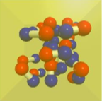
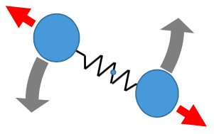
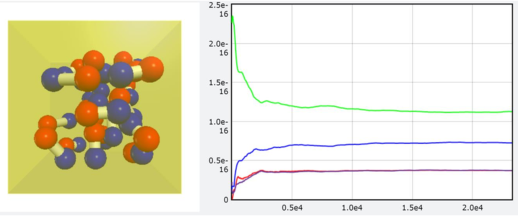

# VP8: Equipartition of energy [class and module]

## Video and HW pdf  

+ [Video](https://goo.gl/2jEFkT)  
+ [HW pdf](https://drive.google.com/file/d/1oycG_GkmCxZVoXSST1V3fuDLpQVDrhlb/view)  

## Contents  

+ [Introduction](#i-introduction)  
+ [the template file of the diatomic module](#ii-the-template-file-of-the-diatomic-module)  
+ [Homework Must Part 1](#iii-homework-must-part-1)  
+ [Homework Must Part 2](#iv-homework-must-part-2)  

## I. Introduction  
For a system in thermal equilibrium, every degree of freedom of every particle has the
same expectation value of energy, hence the name equipartition of energy.  
  
In the figure, we have 20 artificial molecules, each composed of two atoms, O (red ball) and C (blue ball), and they are connected by a bond (white cylinder). Each molecule can have translational motion, vibrational motion, and rotational motion.  
  
+ The translational motion of the center of mass of the molecule has 3 degrees of freedom (f = 3), corresponding to motion in x, y, and z and is associated with kinetic energy of the center of mass, `com_K`.  
+ The vibrational motion (red arrows) has f = 2 and half of it (f = 1) is associated with vibrational kinetic energy `v_K` and half of it (f = 1) vibrational potential energy `v_P`.  
+ The rotational motion (grey arrows) has f = 2, corresponding to the 2 rotational motions with their axes perpendicular to the bond direction, and is associated with the rotational kinetic energy `r_K`. For rotational motion, f = 2 instead of f = 3, because the rotation with the axis parallel to the bond direction is not discernable.  

Since for each available degree of freedom, the expected energy is the same, therefore statistically, if we add up the energies of the different types of motions respectively for all molecules and averaged over time, the ratio between them will be avg_com_K : avg_v_K : avg_v_P : avg_r_K = 3 : 1 : 1 : 2. (**Notice: Here we do not consider quantum effect, therefore all 3 types of the motions will be available**). In this homework, we will simulate that.  

In addition, we will learn to use python’s module feature to finish the homework in a more systematical way. Python provides many useful modules, such as “`numpy`” and “`vpython`”. For example, every time you write “`from vpython import *`”. you can use everything provided by the module ‘`vpython`’, such as `canvas( )`, `sphere( )`, and etc. We can also write our own module. One of the reason is that this module is very useful and can be used again and again in the future. The other reason is that we do not want the main program to look very complicated, so we separate the program into layers, allowing each layer to handle different things. In this homework, we provide two template files, `diatomic.py`, which is the module file to handle each individual CO molecule and their collisions, and `VP8.py`, which is the main program. You need to put these two files into the same file folder. When the module is run for the first time, a `diatomic.pyc` will be generated and stored in the subfolder “`__pycache__`”.  

## II. the template file of the diatomic module  
diatomic.py:
```python
from vpython import *
size, m_o, m_c, k_bond = 31E-12, 16.0/6E23, 12.0/6E23, 18600.0    # These numbers are all made up
d = 2.5*size
dt = 1E-16
class CO_molecule:
    def __init__(self, pos, axis):
        self.O = sphere(pos = pos, radius = size, color = color.red)
        self.C = sphere(pos = pos+axis, radius = size, color = color.blue)
        self.bond = cylinder(pos = pos, axis = axis, radius = size/2.0, color = color.white) 
	self.O.m = m_o
        self.C.m = m_c
        self.O.v = vector(0, 0, 0)
        self.C.v = vector(0, 0, 0)
        self.bond.k = k_bond
    def bond_force_on_O(self):        # return bond force acted on the O atom
        return self.bond.k*(mag(self.bond.axis)-d)*norm(self.bond.axis)

    def time_lapse(self, dt):         # by bond's force, calculate a, v and pos of C and O, and bond's pos and axis after dt 
        self.C.a = - self.bond_force_on_O() / self.C.m
        self.O.a = self.bond_force_on_O() / self.O.m
        self.C.v += self.C.a * dt
        self.O.v += self.O.a * dt
        self.C.pos += self.C.v * dt
        self.O.pos += self.O.v * dt self.bond.axis = self.C.pos - self.O.pos self.bond.pos = self.O.pos
    
    def com(self):                    # return position of center of mass
        return vector(0, 0, 0)
    def com_v(self):                  # return velocity of center of mass
        return vector(0, 0, 0)
    def v_P(self):                    # return potential energy of the bond for the vibration motion
        return 0
    def v_K(self):                    # return kinetic energy of the vibration motion
        return 0
    def r_K(self):                    # return kinetic energy of the rotational motion
        return 0
    def com_K(self):                  #return kinetic energy of the translational motion of the center of mass
        return 0
        

def collision(a1, a2):
    v1prime = a1.v - 2 * a2.m/(a1.m+a2.m) *(a1.pos-a2.pos) * dot (a1.v-a2.v, a1.pos-a2.pos) / mag(a1.pos-a2.pos)**2
    v2prime = a2.v - 2 * a1.m/(a1.m+a2.m) *(a2.pos-a1.pos) * dot (a2.v-a1.v, a2.pos-a1.pos) / mag(a2.pos-a1.pos)**2
    return v1prime, v2prime
     
if __name__ == '__main__':
    a = CO_molecule(pos=vector(0, 0, 0), axis = vector(2.6*size, 0, 0))
    a.O.v = vector(1.0, 1.0, 0)
    a.C.v = vector(2.0, -1.0, 0)
    a.time_lapse(dt)
    print(a.bond_force_on_O(), a.com(), a.com_v(), a.v_P(), a.v_K(), a.r_K(), a.com_K())

```
Here, some usage of python syntax new to you is explained in the following:  
`class CO_molecule:`  
We declare a class called `CO_molecule`, which does not inherit from any previous known class, thus no parentheses behind it. For a new class, usually the first method is `__init__(self, ....)`, before and behind init are double underlines.  
```python
def __init__(self, pos, axis): 
    ......
```
is to initialize the object when `CO_molecule( pos = ..., axis=...)` is called to create an object. Here, it first creates two sphere object for O atom and C atom and creates a cylinder for the bond. It then assigns the basic parameters for the CO molecule.  
Then we write all other methods to complete the class. These include  
```python
def bond_force_on_O(self):    # return bond force acted on the O atom 
    return self.bond.k*(mag(self.bond.axis)-d)*norm(self.bond.axis)
```
to calculate the force acting by the bond on the O atom by assuming the bond works like a spring, and  
```python
def time_lapse(self, dt):     # by bond's force, calculate a, v and pos of C and O, and bond's pos and axis after dt 
    ......
```
to calculate both C and O atoms’ acceleration and then to calculate both atoms’ velocities and positions, bond’s position and axis, for a short time `dt`.  

## III. Homework Must Part 1
It is your job to finish the rest methods for class `CO_molecule`. `com( )` is to return the position vector of the center of the mass of the molecule. `com_v( )` is to return the velocity vector of the center of mass. `v_P( )` is to return the potential energy stored in the bond similar to the potential energy stored in a spring. `v_K( )` is to return the kinetic energy associated to the two atoms’ motion relative to the center of mass and parallel to the bond axis. `r_K( )` is to return the kinetic energy associated to the two atoms’ motion relative to the center of mass and perpendicular to the bond axis. `com_K( )` is to return of kinetic energy of the center of mass.  
After you finish writing all the methods in `CO_molecule` class, you should check its correctness before proceeding to the main program. If this file, ‘`diatomic.py`’ is executed by itself as the main program, the lines under `if __name__ == '__main__':` will be executed. If this file is imported from other program as a module, the lines under `if __name__ == '__main__':` will not be executed. This is a convenient way to test the correctness of this module. This way of coding has an advantage. One can separate a large program into several modules with smaller sections of codes, which are more easily to debug. It means that we can write smaller sections of codes and debug them without wasting time on other modules.  
After you complete `diatomic.py` correctly, you can test your module’s correctness by the following code:  
```python
if __name__ == '__main__':
    a = CO_molecule(pos=vector(0, 0, 0), axis = vector(2.6*size, 0, 0))
    a.O.v = vector(1.0, 1.0, 0)
    a.C.v = vector(2.0, -1.0, 0)
    a.time_lapse(dt)
    print(a.bond_force_on_O(), a.com(), a.com_v(), a.v_P(), a.v_K(), a.r_K(), a.com_K())
```
This will generate `a`, an object from class `CO_molecule`, with the given `pos` and `axis`. It will then assign the velocities for `a`'s two atoms O and C. It then runs `a.time_lapse(dt)` to let `a` to proceed a short time `dt`. Then, if your codes are correctly written, you will have the following printed results:  
```
<5.76609e-08, -1.43079e-13, 0> <3.4543e-11, 1.42857e-17, 0> <1.42857, 0.142857, 0> 8.937585694598954e-20 1.4028593914919891e-24 2.2857114754936572e-23 4.8095238095238086e-23
```

## IV. Homework Must Part 2
the template file of the main program `VP8.py`
```python
from vpython import * 
from diatomic import *

N = 20                                 # 20 molecules
L = ((24.4E-3/(6E23))*N)**(1/3.0)/50   # 2L is the length of the cubic container box, the number is made up
m = 14E-3/6E23                         # average mass of O and C
k, T = 1.38E-23, 298.0                 # some constants to set up the initial speed
initial_v = (3*k*T/m)**0.5             # some constant

scene     = canvas(width = 400, height =400, align = 'left', background = vec(1, 1, 1)) 
container = box(length = 2*L, height = 2*L, width = 2*L, opacity=0.4, color = color.yellow ) 
energies  = graph(width = 600, align = 'left', ymin=0)

c_avg_com_K = gcurve(color = color.green)
c_avg_v_P   = gcurve(color = color.red)
c_avg_v_K   = gcurve(color = color.purple)
c_avg_r_K   = gcurve(color = color.blue)

COs=[]

for i in range(N):                     # initialize the 20 CO molecules
    O_pos = vec(random()-0.5, random()-0.5, random()-0.5)*L       # random() yields a random number between 0 and 1 
    CO = CO_molecule(pos=O_pos, axis = vector(1.0*d, 0, 0))       # generate one CO molecule
    CO.C.v = vector(initial_v*random(), initial_v*random(), initial_v*random())    # set up the initial velocity of C randomly 
    CO.O.v = vector(initial_v*random(), initial_v*random(), initial_v*random())    # set up the initial velocity of O randomly 
    COs.append(CO)                     # store this molecule into list COs
    
times = 0                              # number of loops that has been run
dt    = 5E-16 
t     = 0
while True:
    rate(3000) 
    for CO in COs:
        CO.time_lapse(dt)
        
    for i in range(N-1):               # the first N-1 molecules
        for j in range(i+1,N):         # from i+1 to the last molecules, to avoid double checking
        pass                           ## change this to check and handle the collisions between the atoms of different molecules 
        
    for CO in COs:
        pass                           ## change this to check and handle the collision of the atoms of all molecules on all 6 walls
    
    ## sum com_K, v_K, v_P, and r_K for all molecules, respectively, to get total_com_K, total_v_K, total_v_P, total_r_K at the
    ## current moment
    
    ## calculate avg_com_K to be the time average of total_com_K since the beginning of the simulation, and do the same 
    ## for others.
    
    ## plot avg_com_K, avg_v_K, avg_v_P, and avg_r_K

```

In this main program, all the codes are explained by the corresponding comments. Read them carefully. You need complete all those marked by `##`. If your program works well, you will observe something similar to the following figure, in which 
```
avg_com_K : avg_v_K : avg_v_P : avg_r_K = 3 (green) : 1 (red) : 1(purple) : 2(blue).
```
  

### HW submission (PLZ be particularly aware!!)

+ Please upload a `zip` file (a compressed file) to CEIBA. Note that the filename extension should be `.zip`, and other format (e.g. `.rar` , `.tar` ...) is not allowed!!  
+ In the zip file, there will be **a directory whose name is your student ID.** The directory should contain 1 or 2 python scripts. Please name the script of must part: `must.py`, and `diatomic.py`.  
+ Please also upload the `zip` file, even if you only plan to submit `must.py`. (This would help ease the burden for me to grade the hw. Thanks for the cooperation \~\~ :grin:)  

Example of submitted format: 
```
homework.zip
└── r07222016
    ├── must.py
    └── diatomic.py
```


### Deadline
`1/10 SUN 22:00`  

### Grading Criteria (For Reference)    
Must  
    0: No Submission.
    1: The program is totally not runnable.
    2: The results in diatomic.py are wrong.
    3: The curves are not correct.
    4: The curves are not so correct.
    5: You complete all the requirements, and they are all correct.
